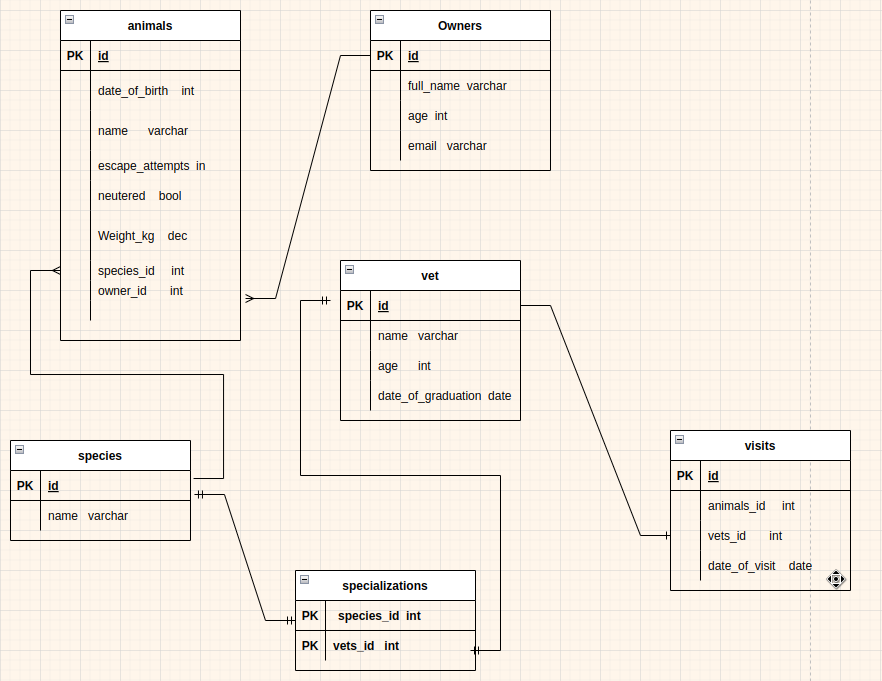

# Bookstore

> Vet_Clinic Database

This is a database that allows for storage of animals information.

- Allows one to create animal.
- Query animals data

## ScreenShort
)

## Built With

- PostgreSQL
- Linux terminal

## Author

👤 **Gordon Otieno**

- GitHub: [@Gordon_Otieno ](https://github.com/GordonOtieno)
- Twitter: [@GordonOtieno](https://twitter.com/gordonotieno)
- LinkedIn: [LinkedIn](https://www.linkedin.com/in/gordon-otieno/)

## 🤝 Contributing

Contributions, issues, and feature requests are welcome!

Feel free to check the [issues page](https://github.com/GordonOtieno/vet_database/issues).

## Show your support

Give a ⭐️ if you like this project!

## 📝 License

This project is [MIT](./MIT.md) licensed.
